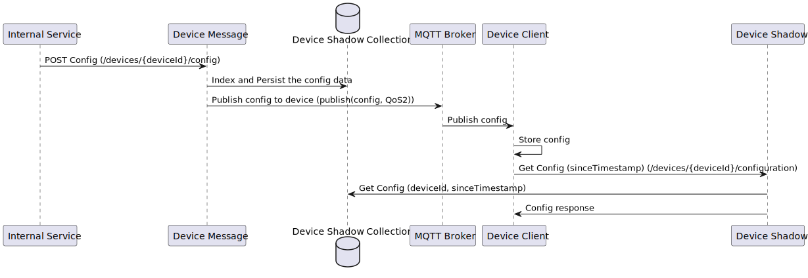

<div align="center">
  
</div>

# Device Message

[](https://github.com/eclipse-ecsp/device-message/actions/workflows/maven-build.yml)
[](https://sonarcloud.io/summary/new_code?id=eclipse-ecsp_device-message)
[](https://sonarcloud.io/summary/new_code?id=eclipse-ecsp_device-message)
[](https://github.com/eclipse-ecsp/device-message/actions/workflows/licence-compliance.yaml)
[](https://github.com/eclipse-ecsp/device-message/releases)

Device message service is used to publish data to devices when there is any new configuration created, updated or deleted by user through API's.

# Table of Contents
* [Getting Started](#getting-started)
* [Architecture](#architecture)
* [Usage](#usage)
* [How to contribute](#how-to-contribute)
* [Built with Dependencies](#built-with-dependencies)
* [Code of Conduct](#code-of-conduct)
* [Contributors](#contributors)
* [Security Contact Information](#security-contact-information)
* [Support](#support)
* [Troubleshooting](#troubleshooting)
* [License](#license)
* [Announcements](#announcements)

## Getting Started

Device Message component exposes API that is invoked by internal service to send the configuration data to the device and also store them in Mongo DB with the attributes like data, domain, version, command along with the config data.

To build the project in the local working directory after the project has been cloned/forked, run:

```mvn clean install```

from the command line interface.

### Prerequisites

The list of tools required to build and run the project:
   - Java 17
   - Maven

### Installation

[Install Java 17](https://www.azul.com/downloads/?version=java-17-lts&package=jdk#zulu)

[How to set up Maven](https://maven.apache.org/install.html)

### Coding style check configuration

[checkstyle.xml](./device-factory-management-api/checkstyle.xml) is the coding standard to follow while writing new/updating existing
code.

Checkstyle plugin [maven-checkstyle-plugin:3.2.1](https://maven.apache.org/plugins/maven-checkstyle-plugin/) is
integrated in [pom.xml](./pom.xml) which runs in the `validate` phase and `check` goal of the maven lifecycle and fails
the build if there are any checkstyle errors in the project.

To run checkstyle plugin explicitly, run the following command:
```mvn checkstyle:check```

### Running the tests

To run the tests for this system run the below maven command.

```mvn test```

Or run a specific test

```mvn test -Dtest="TheFirstUnitTest"```

To run a method from within a test

```mvn test -Dtest="TheSecondUnitTest#whenTestCase2_thenPrintTest2_1"```

### Deployment

1. The component can be deployed as Kubernetes pod by installing Device Message charts.

Link:
[Charts](../../../ecsp-helm-charts/tree/main/device-message)

2. Mongo DB need to installed and database/schema should be created with the required collections.

## Architecture

Sequence diagram of Device Message:
[](device-shadow-flow.svg)

## Usage

Device Message component is responsible for interfacing all communication with the device. Inbound messages are routed via Device Messaging before services process the messages. Outgoing messages from services to devices are also routed via Device Messaging. Under the hood it does a lot more keeping track of device connection status with hivemq, persisting events in database if vehicle is inactive, waking up a device if its inactive , retrying events if device has not received it etc.

## Built With Dependencies

* [Spring](https://spring.io/projects/spring-framework) - Web framework used for building the application
* [Maven](https://maven.apache.org/) - Build tool used for dependency management
* [MongoDB](https://www.mongodb.com/) - MongoDB driver to connect with NoSQL document database
* [Project Lombok](https://projectlombok.org/) - Auto-generates Java boilerplate code (e.g., getters, setters, builders)
* [Apache Common](https://commons.apache.org/proper/commons-lang/) - Java Library
* [Jackson](https://github.com/FasterXML) - Reading JSON Objects
* [Morphia](https://morphia.dev/landing/index.html) - A Java tool for mapping Java objects to MongoDB documents.
* [Logback](https://logback.qos.ch/) - Concrete logging implementation used with SLF4J.
* [slf4j](https://www.slf4j.org/) - Logging facade providing abstraction for various logging frameworks.
* [Mockito](https://site.mockito.org/) - Mocking framework for testing.
* [JUnit](https://junit.org/) - Unit testing framework.

## How to contribute

Please read [CONTRIBUTING.md](./CONTRIBUTING.md) for details on our contribution guidelines, and the process for submitting pull requests to us.

## Code of Conduct

Please read [CODE_OF_CONDUCT.md](./CODE_OF_CONDUCT.md) for details on our code of conduct, and the process for submitting pull requests to us.

## Contributors

The list of [contributors](../../graphs/contributors) who participated in this project.

## Security Contact Information

Please read [SECURITY.md](./SECURITY.md) to raise any security related issues

## Support

Contact the project developers via the project's "dev" list - [ecsp-dev](https://accounts.eclipse.org/mailing-list/)

## Troubleshooting

Please read [CONTRIBUTING.md](./CONTRIBUTING.md) for details on how to raise an issue and submit a pull request to us.

## License

This project is licensed under the Apache-2.0 License - see the [LICENSE](./LICENSE) file for details.

## Announcements

All updates to this component are present in our [releases page](../../releases).
For the versions available, see the [tags on this repository](../../tags).